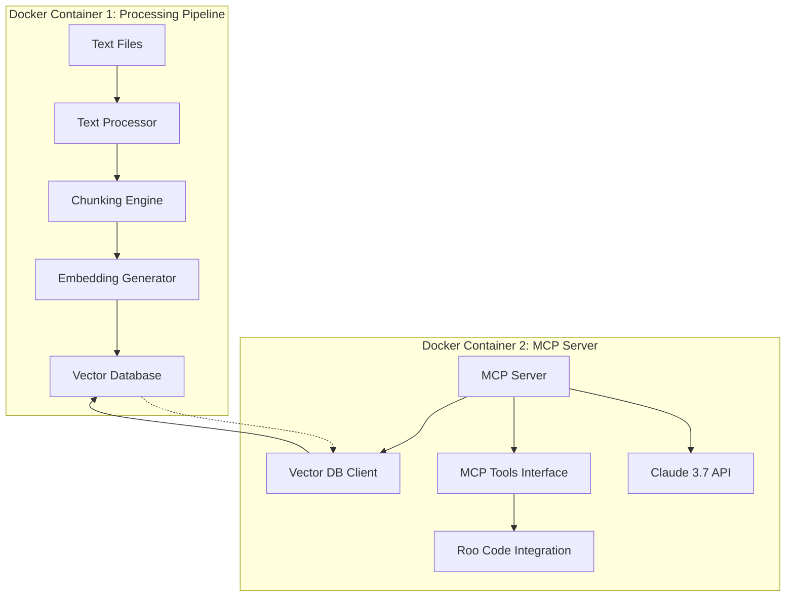

# MCP Server Implementation Plan

## 1. System Architecture Overview



## 2. Implementation Status

The MCP Server has been fully implemented with the following features:

### 2.1 Core Components

- **File Processing Pipeline**: Reads Markdown and text files, chunks them, generates embeddings, and stores them in a vector database.
- **MCP Server**: Exposes the processed content through MCP tools, allowing Roo Code to search and retrieve relevant information.

### 2.2 Key Features

- **Support for Multiple File Types**: Processes both Markdown (.md) and text (.txt) files, with the ability to configure additional file types.
- **Configurable Chunking**: Adjustable chunk size and overlap via environment variables.
- **Embedding Options**: Support for OpenAI embeddings or custom embedding functions.
- **Flexible Response Generation**: Can use Claude API or rely on the client for processing.
- **MCP Tools**: Implemented tools for reading files, searching content, getting context, and more.

### 2.3 Configuration Options

All major parameters are configurable via environment variables:

```
# API Keys
OPENAI_API_KEY=your_openai_api_key_here
ANTHROPIC_API_KEY=your_anthropic_api_key_here  # Optional

# Pipeline Configuration
CHUNK_SIZE=1000                # Size of text chunks
CHUNK_OVERLAP=200              # Overlap between chunks (in tokens)
BATCH_SIZE=10                  # Batch size for embedding generation
EMBEDDING_MODEL=text-embedding-ada-002  # OpenAI embedding model to use
SUPPORTED_EXTENSIONS=.md,.txt  # Comma-separated list of supported file extensions

# Server Configuration
CLAUDE_MODEL=claude-3-7-sonnet-20240307  # Claude model to use
MAX_RESULTS=10                 # Maximum number of results to return
USE_ANTHROPIC=true             # Whether to use Anthropic API for responses

# Custom Embedding Model (optional)
# CUSTOM_EMBEDDING_MODULE=/path/to/your/module.py
# CUSTOM_EMBEDDING_FUNCTION=your_embedding_function

# Paths
DATA_DIR=/data                 # Directory containing input files
OUTPUT_DIR=/output             # Directory for output files
DB_PATH=/db                    # Directory for vector database
CONFIG_PATH=/config/server_config.json  # Path to server configuration file
```

## 3. Project Structure

```
mcp-server/
├── Dockerfile.pipeline
├── Dockerfile.server
├── docker-compose.yml
├── requirements.pipeline.txt
├── requirements.server.txt
├── README.md
├── .env.example
├── src/
│   ├── pipeline.py
│   ├── server.py
│   └── utils/
│       ├── __init__.py
│       ├── chunking.py
│       ├── embedding.py
│       └── vector_db.py
├── config/
│   ├── pipeline_config.json
│   └── server_config.json
├── data/
├── output/
└── db/
```

## 4. Usage Instructions

### 4.1 Setup

1. Clone the repository
2. Create a `.env` file with your configuration (copy from `.env.example`)
3. Place your Markdown and text files in the `data/` directory

### 4.2 Running the Pipeline

```bash
docker-compose build pipeline
docker-compose run pipeline
```

### 4.3 Running the MCP Server

```bash
docker-compose build server
docker-compose up -d server
```

### 4.4 Connecting to Roo Code

Configure Roo Code to connect to the MCP server by adding the following to your Roo Code configuration:

```json
{
  "mcpServers": {
    "mcp-server": {
      "command": "docker",
      "args": [
        "exec",
        "-i",
        "mcp_server_1",
        "python",
        "server.py"
      ]
    }
  }
}
```

## 5. Implementation Notes

- The system is designed to be modular and configurable.
- It supports both OpenAI embeddings and custom embedding functions.
- The MCP server can operate in two modes:
  - Full Processing Mode: Uses Claude API to generate responses.
  - Context Retrieval Mode: Returns context for the client to process.
- All configuration options can be set via environment variables.
- The system is containerized for easy deployment.